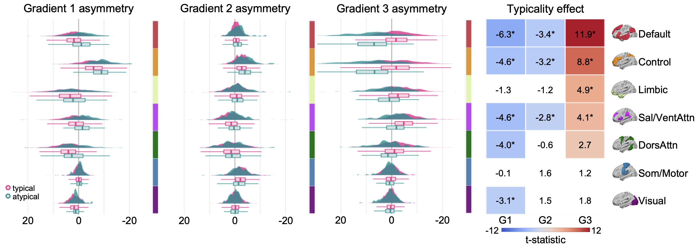
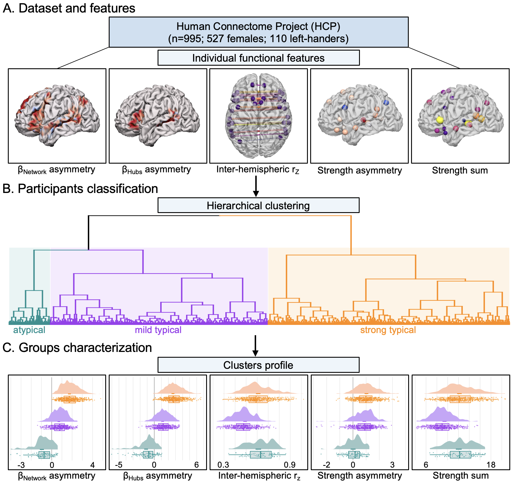
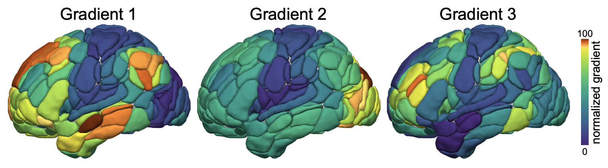

Language network lateralization is reflected throughout the macroscale
functional organization of cortex
================

## Reference

**Labache, L.**, Ge, T., Yeo, B.T. T., Holmes, A. J. (2022). Atypical
language network lateralization is reflected throughout the macroscale
functional organization of cortex. bioRxiv. DOI:
[10.1101/2022.12.14.520417](https://doi.org/10.1101/2022.12.14.520417)

------------------------------------------------------------------------

## Background

**Hemispheric specialization** is a fundamental feature of human brain
organization. However, it is not yet clear to what extent the
*lateralization of specific cognitive processes may be evident
throughout the broad functional architecture of cortex*. While the
majority of people exhibit left-hemispheric language dominance, a
substantial minority of the population shows reverse lateralization.
Using twin and family data from the Human Connectome Project, we provide
evidence that atypical **language dominance is associated with global
shifts in cortical organization**. Individuals with atypical language
organization exhibited corresponding hemispheric differences in the
macroscale functional gradients that situate discrete large-scale
networks along a continuous spectrum, extending from unimodal through
association territories. Analyses revealed that both language
lateralization and gradient asymmetries are, in part, driven by genetic
factors. These findings pave the way for a deeper understanding of the
origins and relationships linking population-level variability in
hemispheric specialization and global properties of cortical
organization.

------------------------------------------------------------------------

## Code release

The `Script` folder contains 4 files:

- `-.rtf`: README file containing information about -
- `-`: —
- `-`: —
- **-**.

------------------------------------------------------------------------

## Data

All the data used are brain fMRI data from the Human Connectome Project
(HCP; n=995). The HCP data requires data access permission and if you
have this, we are happy to share the processed data used here.

- The primary data used are the 5 functional features characterizing the
  high-order language network (see
  [SENSAAS](https://github.com/loiclabache/SENSAAS_brainAtlas)). These 5
  features have been previously shown to accurately determine the
  language network lateralization at the individual level ([Labache et
  al, 2020](https://doi.org/10.7554/eLife.58722)).

- The second set of data used are the region-level functional
  connectivity matrices (384 × 384
  [AICHA](https://doi.org/10.1016/j.jneumeth.2015.07.013) brain
  regions). Those matrices have been used to compute the first 3
  functional gradients ([Margulies et al,
  2016](https://doi.org/10.1073/pnas.1608282113)).

All data used in the paper and to generate all figures are provided in
`Data` folder.

------------------------------------------------------------------------

## Atlas used

- [SENSAAS](https://github.com/loiclabache/SENSAAS_brainAtlas) is
  composed of 18 regions of interest corresponding to the **core
  language network**. The core language network corresponds to a set of
  heteromodal brain regions *significantly involved, leftward
  asymmetrical across 3 language contrasts* (listening to, reading, and
  producing sentences), and intrinsically connected.

- [AICHA](https://www.gin.cnrs.fr/en/tools/aicha/) is a functional brain
  ROIs atlas based on resting-state fMRI data acquired in 281
  individuals. AICHA ROIs cover the whole cerebrum, each having 1-
  homogeneity of its constituting voxels intrinsic activity, and 2- a
  unique homotopic contralateral counterpart with which it has maximal
  intrinsic connectivity.

------------------------------------------------------------------------

## Other related papers that might interest you

- Sentence Supramodal Areas Atlas:
  [SENSAAS](https://github.com/loiclabache/SENSAAS_brainAtlas)
- Typical and Atypical Language Brain Organization: Labache, L., et
  al. 2020. DOI:
  [10.7554/eLife.58722](https://doi.org/10.7554/eLife.58722)

------------------------------------------------------------------------

## Questions

Please contact me (Loïc Labache) as <loic.labache@yale.edu> and/or
<loic.labache@ensc.fr>
